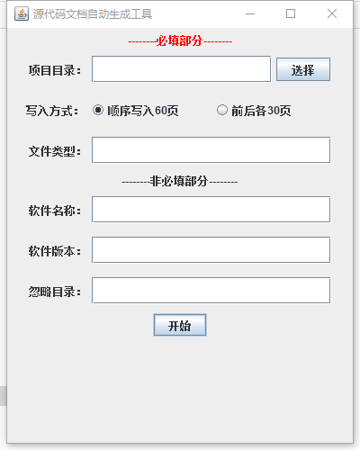
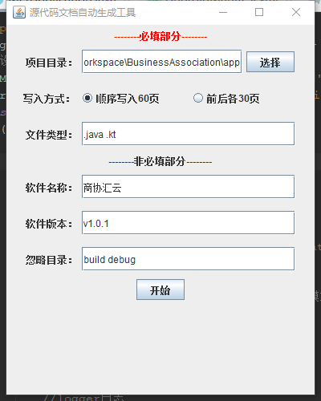
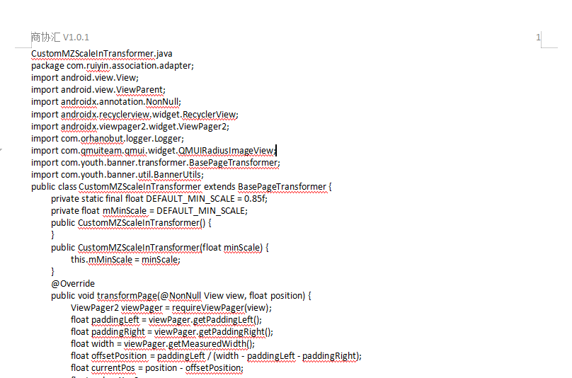

## SourceCodeDocxGenerator
 SourceCodeDocxGenerator是一个自动生成软著申请所需的项目源代码Word文档的工具，使用它可以很方便地生成60页的源代码文档，而不用手动撸。  
 SourceCodeDocxGenerator基于Apache POI实现，详情请参考代码。 
 
 ## 更新
 SourceCodeDocxGenerator目前已支持图形界面操作，可下载根目录下的[SourceCodeDocxGenerator.exe](https://github.com/CharlieJiang/SourceCodeDocxGenerator/blob/main/SourceCodeDocxGenerator.exe)文件直接运行。  
 * **图形界面使用截图**   
   
 * **参数说明**   
 **忽略目录**参数用于填写扫描时需要忽略的源代码目录，只需要输入目录名而无需输入目录的相对或绝对路径，多个目录间以空格分割，如"build debug release"。  
 其它参数请参考下方说明。
 
## 生成的源代码Word文档示例  

 
## 注意
1. ~~此工具目前只支持生成一种文件类型的源代码文档，如.java，如果要过滤多种文件类型，可以考虑修改此项目源码。~~目前已支持生成多种文件类型的源代码文档，具体使用方法见下方。
2. 此项目是为了Android软件申请软著开发，所以在目录过滤时未考虑Java项目以及其他语言项目，可能会存在将项目自动生成的代码写进文档中的情况，后续会进行改进。
3. 为了保证源代码的完整性，最后一个准备写入Word的源代码文件的内容会被全部写入Word中，由此也会导致最终生成的源代码Word文档的页数可能会超过60页，这时就需要手动调整文档页数。

## 使用SourceCodeDocxGenerator.jar
 本项目已打包成可运行的jar文件，即项目中的SourceCodeDocxGenerator.jar，可以直接在命令行中使用，使用命令格式如下：
 ```
 java -Dfile.encoding=utf-8 -jar jar文件路径 项目路径 软件名称 版本号 是否分为前后各30页 源代码文件类型
 ```
 其中`-Dfile.encoding=utf-8`指定了JVM的字符集为UTF-8，以保证生成的Word文档中的中文不会出现乱码。  
 `jar文件路径`是SourceCodeDocxGenerator.jar下载到本地的路径  
 `项目路径`是源代码项目的本地路径  
 `软件名称`和`版本号`是用于生成Word文档的页眉的  
 `是否分为前后各30页`是区分要前后各30页写入源码（true）还是顺序写入60页源码（false）   
 `源代码文件类型`是指要从项目中提取的源代码的文件类型，如.java等，目前已支持多种文件类型，以空格区分。如“.java .kt”。    
 使用SourceCodeDocxGenerator.jar的命令举例：  
 ```
 java -Dfile.encoding=utf-8 -jar D:\Github\SourceCodeDocxGenerator.jar D:\git_workspace\MerchantClient\app XX商户端 V1.0.7 true .java .kt
 ```
